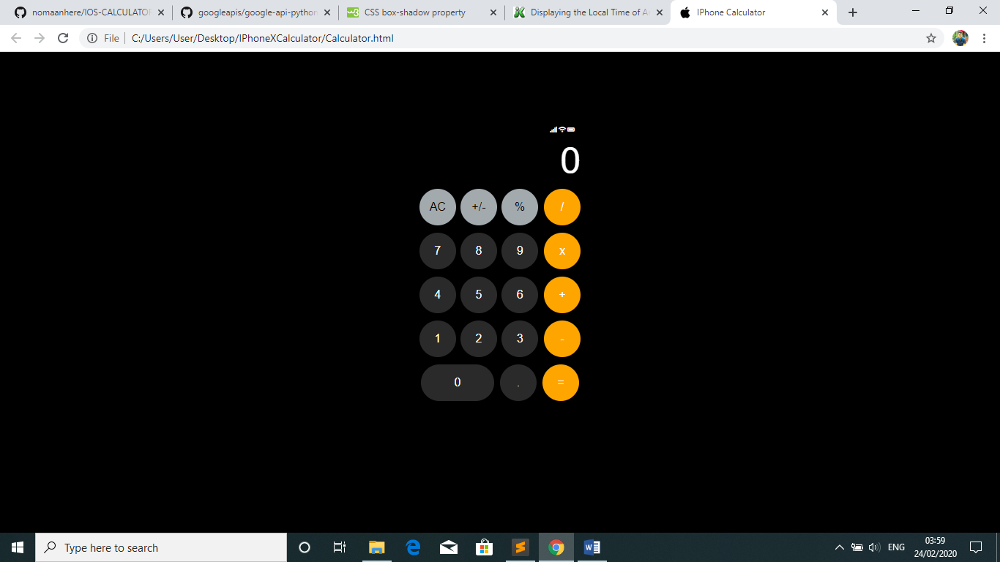

Just a simpe interface where we can use iphone calculator on a website. 

//into development stage

Demo:

To-do:
1.	Change of color of the operator when being used
2.	Some CSS (box-shadow, time API, etc)

Utility:
$ git clone https://github.com/nomaanhere/IPhone-Calculator.git

Head over to HTML, CSS, JavaScript files for further <code>development</code>
